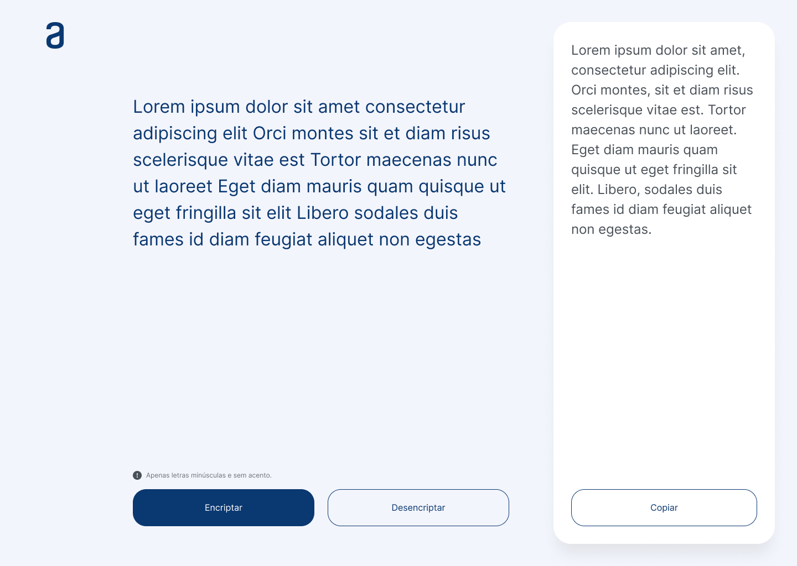

# Encriptador de texto ⌨️ 

Este proyecto fue creado como parte del Challenge ONE de Oracle y Alura Latam. [¡Échale un vistazo!](<https://es.wikipedia.org/wiki/Macarrón_(galleta)>)

# ¿En qué consiste?
La persona ingresa el texto que desee, siguiendo las reglas para un correcto funcionamiento. 
Dependiendo de lo que quiera realizar, puede encriptar o desencriptar su texto, además de tener disponible un botón para copiar el texto ya convertido.

La aplicación sigue estos estándares:

`La letra "e" es convertida para "enter"`

`La letra "i" es convertida para "imes"`

`La letra "a" es convertida para "ai"`

`La letra "o" es convertida para "ober"`

`La letra "u" es convertida para "ufat"`

# Reglas
- Utilizar sólo letras minúsculas.
- No usar acentos ni caracteres especiales.

# Tecnologías utilizadas
- 
- 
- 

# Vista previa

